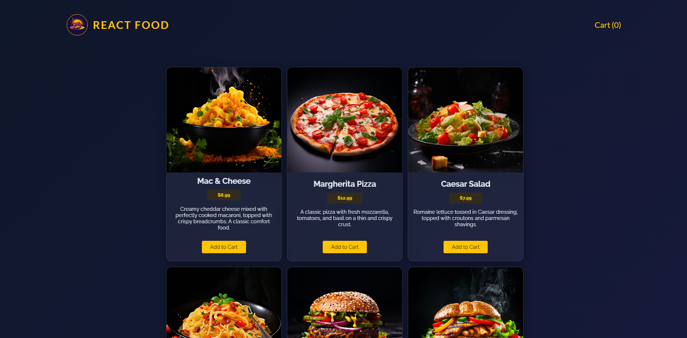
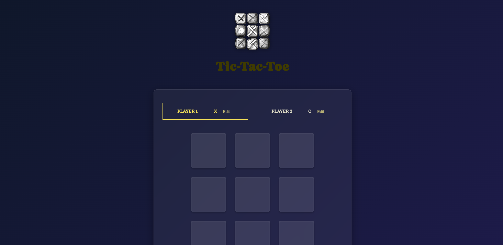
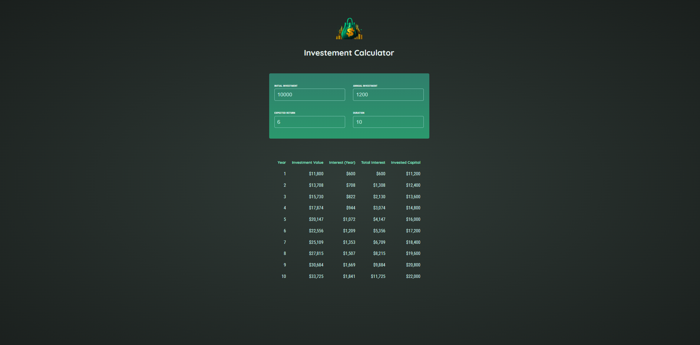

<div align="center">
  

  # ⚛️ Enterprise React Engineering Sandbox

  <div align="center">
    
    
    
    
    
  </div>

  <h3>Showcasing Advanced UI Patterns, Performance Optimization, and Applied AI Integrations</h3>
</div>

<br />

## 🚀 Overview

This repository serves as a **React Engineering Sandbox** reflecting my capabilities as a **Senior Full Stack Engineer & Applied AI Specialist**. Rather than a single monolithic app, it is a collection of 20+ specialized micro-applications and architectural proofs-of-concept. 

The primary goal of this sandbox is to demonstrate a deep understanding of modern React ecosystem capabilities, ranging from advanced state management and context isolation, to performance-critical rendering loops and integration of AI-assisted design patterns. Highlighted projects feature **Premium Glassmorphism UI**, optimized component lifecycles, and scalable enterprise-grade directory structures.

## ✨ Key Features & Architectural Highlights

- **Clean Architecture & Separation of Concerns**: Logic is aggressively separated from presentation. Custom hooks (`useHttp`, `useTheme`, etc.) drive the data layer while pure components handle rendering.
- **Premium UX/UI Engineering**: Implementations of modern design trends including Glassmorphism, tailored variable-based dark/light modes, micro-animations, and fluid responsive typography.
- **Advanced State Management**: Showcasing complex state lifting, `useContext` orchestrations, and Redux patterns across highly interactive domains (like real-time cart systems and matrix-based board games).
- **Applied AI Readiness**: The codebase is strictly typed, heavily modularized, and cleanly documented, representing a foundation perfectly tuned for extending with LLM function-calling wrappers or AI-driven analytics.

## 💻 Tech Stack

| Domain | Technologies |
|---|---|
| **Core Framework** | React 18, Vite |
| **Styling & UI** | Vanilla CSS3 (CSS Variables, Flexbox/Grid, Glassmorphism), Component-scoped logic |
| **State Management** | Context API, Custom Hooks, Redux Basics |
| **Tooling** | NPM, Esbuild, Prettier/ESLint conformant |

## 📸 Highlighted Projects Gallery

| 🍱 Food Order App | ❌⭕ Tic-Tac-Toe | 📈 Investment Calculator |
| :---: | :---: | :---: |
| *E-commerce cart showing custom hooks and state lifting.* | *Interactive board game demonstrating multi-dimensional arrays.* | *Financial tooling showing complex tabular re-rendering.* |
|  |  |  |

> *Note: Place your screenshots inside the `/assets` folder at the root with the exact names `food-order-main.png`, `tic-tac-toe-main.png`, and `investment-calculator-main.png` to render them.*

## 🛠️ Setup & Local Development

Since this repository is a collection of micro-apps, you must navigate to the specific project directory you wish to explore.

1. **Clone the repository**
   ```bash
   git clone https://github.com/your-username/react-essentials.git
   cd react-essentials
   ```

2. **Navigate to a highlighted project**
   ```bash
   # For example, to run the Food Order App:
   cd food-order
   ```

3. **Install Dependencies**
   ```bash
   npm install
   ```

4. **Start the Development Server**
   ```bash
   npm run dev
   ```

---
<div align="center">
  <i>Engineered with 💡 and clean code principles.</i>
</div>
